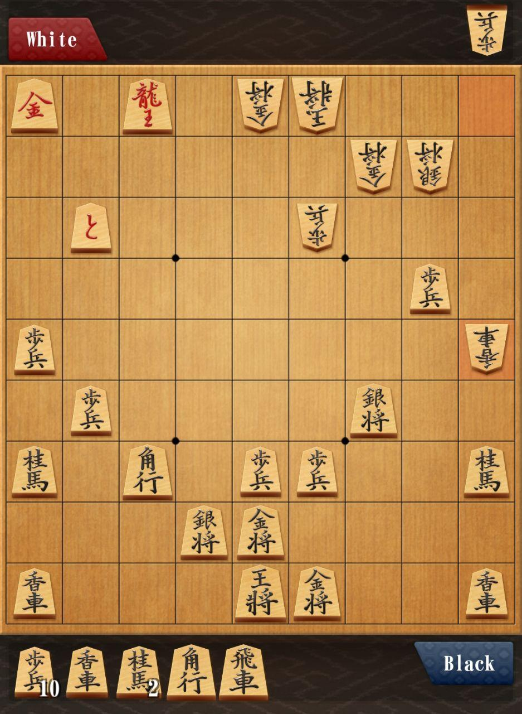

# ShogiWebApp

En este proyecto crearemos una aplicación WEB para jugar al Shogi. El objetivo final es poder jugar al Shogi contra otra persona tanto en tu red local como desde otras redes (internet). Visualmente no ha de ser precioso, con un simple tablero y unas fichas nos basta y sobra.

## Pre Requisitos

Lo primero es saber jugar al shogi, para ello leed uno de los 2 archivos que hay en [shogiTutorials](./shogiTutorials) los cuales os darán una idea de como funciona el shogi. No hace falta saber nada mas, el resto de conocimientos se pueden aprender segun avance el proyecto y segun os pegueis con ello.

## Que Vamos a Usar

La idea es usar [TypeScript](https://www.typescriptlang.org/), [React](https://reactjs.org/), [html/css](https://www.google.com/) y para conectar a la gente algo tipo [socket.io](https://socket.io/get-started/chat) o [webSocket](https://developer.mozilla.org/en-US/docs/Web/API/WebSockets\_API)  

## Como Deberia Quedar Visualmente Hablando

